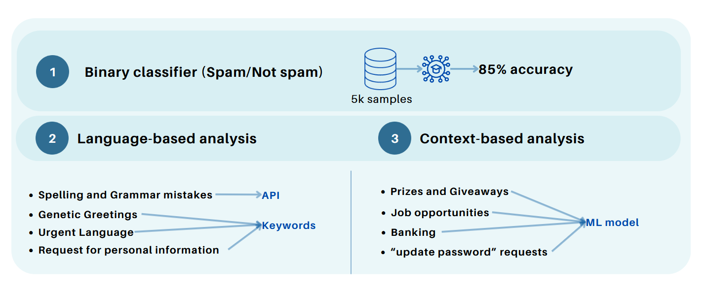

<h1 align="center">
Advanced Security</h1>
<div>
<td> 
</td>
<h2 style="white-space: nowrap">Email Threat Verification Tool</h2></td>
<hr style="clear:both">
<p style="font-size:0.85em; margin:2px; text-align:justify">
<br>
<br>
</div>

**Goal of the project:** The goal of this project is to create a tool that help users to identify email spam / phishing attempts or malware distribution. This is done by using AI models / Keyword identification and educating users of the processes involved in emails and emails threats in general to improve the awareness and reduce potential attacks. 


### The Tool Architecture:

The following image illustrates the general overview of the tool. This tool is separated in three parts which will be described below.

<div style="display: flex; justify-content: center;">
    
</div>

## Table of Contents
* [1. General Email Information](#1-general-email-information)
* [2. Header](#2-header)
* [3. Content](#3-content)
* [4. Website Architecture](#4-website-architecture)
* [5. Running the Code](#5-running-the-code)
* [6. Written Report and Presentation](#6-written-report-and-presentation)

### 1. General Email Information
-------------------------------------------

<div style="display: flex; justify-content: center;">
    
</div>
<br/>

In the first category, the aim is to provide users with essential details about the email. This includes information such as the unique message ID, the timestamp indicating when the email was created, the sender's email address, the number of recipients, and the subject line. While these details are visible in any email client, highlighting the recipient count can offer users an extra layer of awareness. Additionally, we decided to put some alerts in four specific cases by highlighting the text (in red) for the user to be aware / cautious in the following cases: when the number of recipients is over 10 as this could be an instance of a spam mail list, when the attachments are of type .exe (for example executable files) or zip files. We also created a machine learning model able to classify subject lines as being spam or not spam. This was done by getting a publicly available dataset from internet and training a ML model (more precisely Nayve Bayes) to learn to classify subject lines from being spam or not spam. Finally, we decided to compute the cosine similarity between the displayed link and the actual link (which can be found in the original email html tag) to see if the email does not contain potential dangerous / erroneous or malicious links. When any of those cases are encountered, the text is highlighted in red, serving as a reminder for users to exercise caution. 

### 2. Header
-------------------------------------------

<div style="display: flex; justify-content: center;">
    
</div>
<br/>
In the second category, we decided to analyze the email header in detail, specifically to verify whether various authentication mechanisms, more precisely SPF, DKIM and DMARC passed the required tests – allowing to give information related to the authenticity / integrity of the email. However, it is important to mention that if those tests fail, they do not necessarily mean that the emails are spam, as some failed tests could be linked to bad configuration. Additionally, we also decided to add sender’s mail IP address analysis allowing to pinpoint precise information such as the ISP, longitude, and latitude. This step adds another layer of verification, helping to identify the origin of the email and potentially flagging suspicious sources. We also decided to run a final test to check the sender email address to a blacklist of email address, containing a more than 5000 email addresses known to send spam. 


### 3. Content
-------------------------------------------

<div style="display: flex; justify-content: center;">
    
</div>
<br/>


In the third category, we focused on analyzing the content of the email in three distinct ways. Firstly, we employ a machine learning model trained on a dataset of 500 samples to determine whether the email is categorized as spam or not. Then, we used another model for language-based classification, aiding in identifying potential errors such as misspellings or grammatical mistakes. This allows to give information to users about potential grammar mistakes that could be indicative of spam or phishing attempts. Lastly, we conduct a content-based classification as well as using zero-shot classification (using a Machine Learning Model from Hugging Face) to identify the topic of the email, such as financial or password-related issues. Those allowed to provide users with insights into the content of the email and therefore raise more awareness concerning the email received. 


### 4. Code Architecture
-------------------------------------------

<div style="display: flex; justify-content: center;">
    
</div>
<br/>

The website contains a simple python server that handles all the queries related to the three major functions, replicating the three categories discussed previously. In each of these functions, we have python code that handle the requests of the machine learning model, API calls or keywords functions and return results as JSON. Finally, the results are sent to the react js webpage that serve as the front-end to display the results. 

### 5. Running the code:
-------------------------------------------

The projet is organized in two main parts, first we have the code for the notebooks (which contain all related to each category) and the folder **website** to run the website. In this section we will discuss on how to run this part of the code.

The code is separated in two parts: 
  - frontend: the React JS project
  - backend: the Flask python server

**How to run the code ?**

- **1. Start with the backend**
- ```bash
  cd website
  cd backend
- Once in the backend folder, we have two options:
  - **Option 1:**
    - ```bash
      python app.py
  - **Option 2:**
    - ```bash
      docker build -t backend-email-threat-tool_1 .
      docker run -p 5001:5001 backend-email-threat-tool_1
    - Don't forget to rebuild images before docker-compose up if changes are made to frontend or backend

- **2. The frontend**
- ```bash
  cd website
  cd frontend
- Once in the frontend folder, we have two options:
  - **Option 1:**
    - ```bash
      npm start
  - **Option 2:**
    - ```bash
      docker build -t frontend-email-threat-tool_1 .
      docker run -p 80:80 frontend-email-threat-tool_1
      (if not building last version) docker build --no-cache -t frontend-email-threat-tool_1 .


- **3. To run the docker-compose: easier**
  - Run both dockerfiles at the same time, go to the folder frontend-and-backend and run: (we use -d --build to rebuild the images)
      - ```
        docker-compose up -d --build
        ```
  - To restart the build: docker-compose up -d --build && docker compose watch


### 6. Written Report and Presentation
-------------------------------------------